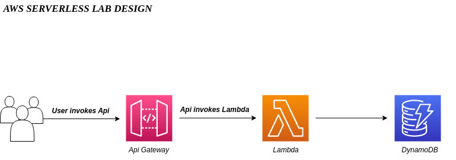

# AWS Serverless Lab

## Overview and Design

Start with the High Level Design.


An Amazon API Gateway is a collection of resources and methods. The method is backed by a Lambda function (LambdaFunctionOverHttps). That is, when you call the API through an HTTPS endpoint, Amazon API Gateway invokes the Lambda function.

POST Method on the DynamoDBManager resource supports the folowing DynamoDB operations: 
- Create, update, and delete item
- Read an item
- Scan an item

The following is a sample request payload for a DynamoDB create item operation:
```
{
    "operation": "create",
    "tableName": "lambda-apigateway",
    "payload": {
        "Item": {
            "id": "1",
            "name": "Ivo Dimitrov"
        }
    }
}
```
or with curl ...
```
$ curl -X POST -d "{\"operation\":\"create\",\"tableName\":\"lambda-apigateway\",\"payload\":{\"Item\":{\"id\":\"1\",\"name\":\"Ivo Dimitrov\"}}}" https://$API.execute-api.$REGION.amazonaws.com/prod/dynamodbmanager
```
To get all the inserted items from the table, we can use the "list" operation of Lambda using the same API. Pass the following JSON to the API, and it will return all the items from the Dynamo table
```
{
    "operation": "list",
    "tableName": "lambda-apigateway",
    "payload": {
    }
}
```
## Setup
```
terraform init
terraform plan
terraform applay
```